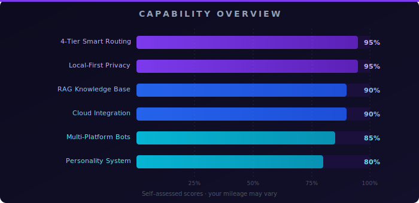
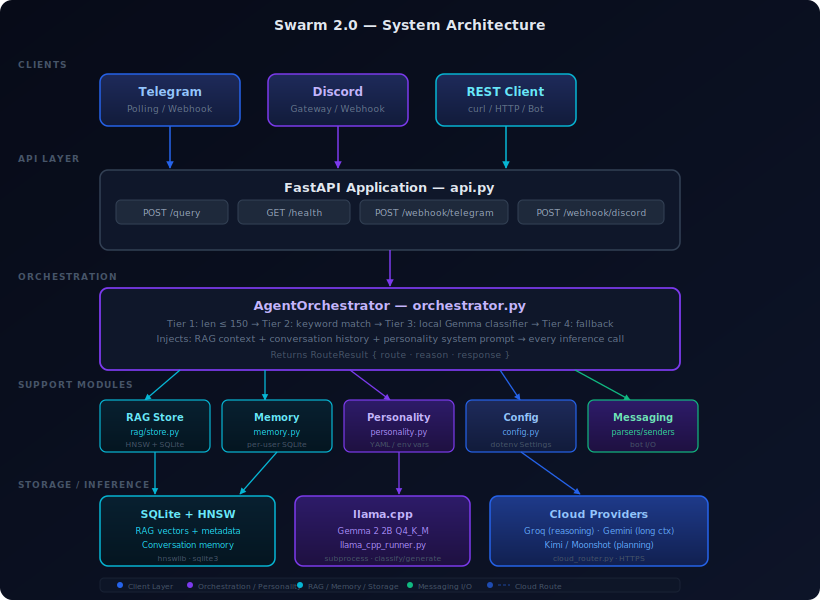
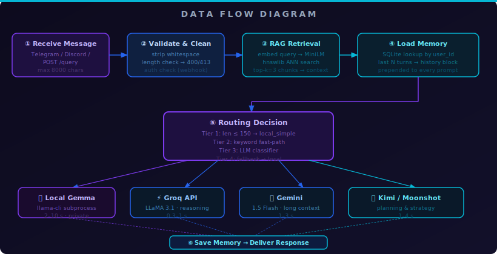
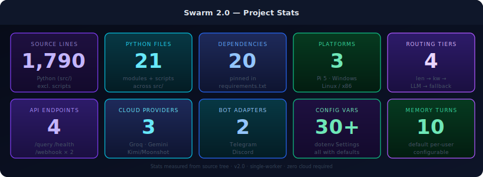

<div align="center">
  
</div>

<br/>

> *"Why choose between your local model sweating on a Raspberry Pi and burning your cloud budget, when you can have a sophisticated 4-tier routing system make that call for you — correctly, 95% of the time?"*

**Swarm2.0** is a hybrid AI assistant that runs on your **Raspberry Pi 5** or **Windows PC**.  
It intelligently routes every message to the best backend: local [`llama.cpp`](https://github.com/ggerganov/llama.cpp) inference, Groq, Gemini, or Kimi — whichever is fastest and most appropriate — while injecting conversation memory and RAG context into every single prompt. It talks to you through Telegram and Discord. It has a configurable personality. It runs on a $100 computer. It does not require a GPU.

---

<div align="center">

[](https://python.org)
[](https://fastapi.tiangolo.com)
[](LICENSE)
[](https://www.raspberrypi.com/products/raspberry-pi-5/)
[](https://www.raspberrypi.com/)
[](https://telegram.org)

</div>

---

## 🎬 In Action

> **Place demo GIF here:** `assets/demo.gif`


*The GIF should show: a Telegram message arriving → the `/query` endpoint routing it → a response appearing, with the `route` and `reason` fields visible. Terminal output showing the FastAPI server logs works great here.*

---

## 🧠 What Is This Thing?

Swarm2.0 is a **hybrid agentic assistant** — "hybrid" meaning it doesn't put all its eggs in one inference basket.

Here's the pitch:

- 🦙 **Local inference** via `llama.cpp` running Gemma 2 2B (Q4_K_M, ~1.6 GB RAM) directly on your hardware. No internet required for basic queries. Your data stays on your device.
- ☁️ **Cloud inference** via Groq (lightning-fast reasoning), Gemini (long context), and Kimi/Moonshot (planning and strategy).
- 🧭 **4-tier routing cascade** that decides — per message — which backend to use, based on message length, keyword signals, and (optionally) a local LLM classifier.
- 📚 **RAG (Retrieval-Augmented Generation)** using `sentence-transformers`, `hnswlib`, and SQLite. Drop in `.txt`, `.md`, or `.pdf` files and the assistant can answer questions from them.
- 💬 **Per-user conversation memory** (SQLite) so it actually remembers what you said two messages ago. Revolutionary concept.
- 🎭 **Configurable personality** via `personality.yaml` or environment variables. Name it, give it a vibe, configure its humor. Ship a little chaos.
- 🤖 **Telegram + Discord bots** — polling mode (no public URL needed, great for Windows) or webhook mode (for servers with a public HTTPS endpoint).

---

## ✨ Features

| Feature | Details |
|---|---|
| 🔀 **4-Tier Routing** | Short → keyword fast-path → LLM classifier → local fallback |
| 🦙 **Local Inference** | `llama.cpp` + Gemma 2 2B Q4_K_M via subprocess |
| ☁️ **Cloud Providers** | Groq (LLaMA 3.1), Gemini 1.5 Flash, Kimi/Moonshot v1-8k |
| 📚 **RAG** | `sentence-transformers` embeddings + `hnswlib` ANN + SQLite metadata |
| 💬 **Memory** | Per-`user_id` conversation history in SQLite (configurable N turns) |
| 🎭 **Personality** | YAML or env-var config for name, tone, humor, expertise |
| 📨 **Telegram Bot** | Polling (Windows-friendly) or webhook mode |
| 🎮 **Discord Bot** | WebSocket gateway (polling) or interactions endpoint (webhook) |
| 🔒 **Privacy** | Local path is fully on-device; no data leaves your machine |
| 🥧 **Pi 5 Optimized** | Tuned defaults for 8GB Pi 5 with NVMe; single-worker SQLite-safe |
| 🪟 **Windows Support** | PowerShell install script, `.bat` launcher, Task Scheduler integration |
| ⚡ **FastAPI** | `/health`, `/query`, `/webhook/telegram`, `/webhook/discord` |

---

## 📊 Capability Overview

<div align="center">
  
</div>

---

## 🏗️ Architecture

<div align="center">
  
</div>

> **⚠️ Single-worker constraint:** The RAG store and conversation memory both use SQLite. Do **NOT** run with `uvicorn --workers N`. One worker, one SQLite, no chaos (at least not *that* kind of chaos).

---

## 🌊 Data Flow

<div align="center">
  
</div>

---

## 🚀 Installation

### Prerequisites

- Python 3.10+
- (Optional) [`llama.cpp`](https://github.com/ggerganov/llama.cpp) binary + a `.gguf` model file for local inference
- At least one cloud API key **OR** a local model — you don't need both

<details>
<summary><b>🥧 Raspberry Pi 5 Setup</b></summary>

**Recommended hardware:**
- Raspberry Pi 5 (8 GB RAM)
- NVMe SSD ≥ 128 GB (PCIe HAT) — RAG and model I/O will thank you
- Official 27 W USB-C PSU — don't cheap out here
- Active cooling (fan + heatsink) — thermal throttling begins at 80 °C

**Install:**
```bash
sudo mkdir -p /opt/agentic-assistant
sudo chown -R $USER:$USER /opt/agentic-assistant
# copy this repo to /opt/agentic-assistant first
cd /opt/agentic-assistant
bash deploy/install_pi.sh
```

`install_pi.sh` installs system packages, builds `llama.cpp`, creates a venv, and installs Python dependencies.

**Configure:**
```bash
cp .env.example .env
chmod 600 .env
nano .env
```

**Start:**
```bash
bash scripts/pi_start_and_check.sh
```

This starts the server, waits for `/health`, runs a smoke test `/query`, and prints results.
</details>

<details>
<summary><b>🪟 Windows Setup</b></summary>

```powershell
# 1. Copy/clone the repo to C:\agentic-assistant
cd C:\agentic-assistant

# 2. Install (creates .venv, copies .env and personality.yaml)
powershell -ExecutionPolicy Bypass -File deploy\install_windows.ps1

# 3. Edit .env
notepad .env

# 4. (Optional) Customise personality
notepad personality.yaml

# 5. Start
powershell -ExecutionPolicy Bypass -File scripts\start_windows.ps1
```

See [agentic_assistant/GUIDE.md](agentic_assistant/GUIDE.md) for the full Windows walkthrough including llama.cpp build instructions.

**Pro tip:** Set `BOT_MODE=polling` on Windows — bots will pull messages without needing a public HTTPS URL. Zero ngrok required.
</details>

### Configure `.env`

Copy `.env.example` → `.env` and set your values:

```env
# Bot mode: "polling" (Windows-friendly) or "webhook" (server with public URL)
BOT_MODE=polling

# At least one of these:
GROQ_API_KEY=your_groq_key_here
GEMINI_API_KEY=your_gemini_key_here
KIMI_API_KEY=your_kimi_key_here

# At least one of these:
TELEGRAM_BOT_TOKEN=your_telegram_token
DISCORD_BOT_TOKEN=your_discord_token

# Local inference (optional — omit for cloud-only mode)
MODEL_PATH=/home/pi/models/gemma-2-2b-it-Q4_K_M.gguf
LLAMA_MAIN_PATH=/home/pi/llama.cpp/build/bin/llama-cli
```

#### Key settings at a glance

| Variable | Default | What it does |
|---|---|---|
| `BOT_MODE` | `webhook` | `polling` (no URL needed) or `webhook` |
| `USE_LLM_ROUTING` | `true` | Use local Gemma to classify ambiguous queries |
| `LOCAL_SHORT_THRESHOLD_CHARS` | `150` | Messages shorter than this → local instantly |
| `LONG_CONTEXT_THRESHOLD_CHARS` | `1200` | Messages longer than this → Gemini |
| `MEMORY_MAX_TURNS` | `10` | Conversation turns remembered per user |
| `RAG_TOP_K` | `3` | Knowledge chunks retrieved per query |
| `INFERENCE_THREADS` | `nCPU-1` | Threads for llama.cpp |
| `LLM_CONTEXT_TOKENS` | `2048` | Context window size |
| `MAX_INPUT_CHARS` | `8000` | Hard cap on incoming messages |

---

## 💻 Usage

### API Endpoints

```bash
# Health check — shows routing config and cloud availability
curl http://127.0.0.1:8000/health

# Query — returns response + routing metadata
curl -X POST http://127.0.0.1:8000/query \
  -H "Content-Type: application/json" \
  -d '{"message": "Analyze the pros and cons of microservices"}'
# → {"route": "groq", "reason": "kw_reasoning", "response": "..."}

# The route and reason fields tell you exactly what happened and why
```

### Routing Behavior — 4-Tier Cascade

Every message goes through this waterfall. RAG context and conversation history are injected into **every** prompt regardless of which route is taken.

| Tier | Trigger | Route | Provider | `reason` |
|---|---|---|---|---|
| 1 | `len ≤ 150` and no complex signal | `local_simple` | Local Gemma | `short_message` |
| 2 | `plan / roadmap / strategy / workflow` | `kimi` | Moonshot Kimi | `kw_planning` |
| 2 | `len ≥ 1200` chars | `gemini` | Gemini Flash | `kw_long_context` |
| 2 | `analyze / compare / tradeoff / root cause` | `groq` | Groq LLaMA | `kw_reasoning` |
| 2 | `docs / document / knowledge base / retrieve` | `local_rag` | Local Gemma + RAG | `kw_rag` |
| 3 | Ambiguous → LLM classifier → cloud | varies | Groq / Gemini / Kimi | `llm_classifier` |
| 3 | Ambiguous → LLM classifier → local | `local_simple` | Local Gemma | `llm_classifier_local` |
| 4 | Cloud key missing / API error | `local_fallback` | Local Gemma | `*_unavailable` |

> Set `USE_LLM_ROUTING=false` for deterministic keyword-only routing (faster on minimal hardware).

### Ingest Documents for RAG

Drop `.txt`, `.md`, or `.pdf` files in `data/knowledge/`, then:

```bash
# Linux / Pi
source .venv/bin/activate
export PYTHONPATH=src
python scripts/ingest_documents.py data/knowledge --source knowledge_base

# Windows
$env:PYTHONPATH="src"
.\.venv\Scripts\python.exe scripts\ingest_documents.py data\knowledge --source knowledge_base
```

### Personality Configuration

```yaml
# personality.yaml
name: Aria
personality: friendly, witty, and deeply knowledgeable
response_style: warm and conversational, concise without being curt
humor: clever puns and light tech humour when appropriate
expertise: software engineering, artificial intelligence, creative writing
```

Or set `AGENT_NAME`, `AGENT_PERSONALITY`, `AGENT_RESPONSE_STYLE`, `AGENT_HUMOR`, `AGENT_EXPERTISE` in `.env`. YAML file takes precedence when it exists.

### Running as a Service

**Linux (systemd):**
```bash
sudo cp deploy/agent.service /etc/systemd/system/agent.service
sudo systemctl daemon-reload
sudo systemctl enable --now agent
```

**Windows (Task Scheduler — run once as Administrator):**
```powershell
$action  = New-ScheduledTaskAction -Execute "powershell.exe" `
    -Argument "-ExecutionPolicy Bypass -File C:\agentic-assistant\scripts\start_windows.ps1"
$trigger = New-ScheduledTaskTrigger -AtLogOn
Register-ScheduledTask -TaskName "AgenticAssistant" -Action $action -Trigger $trigger -RunLevel Highest
```

---

## 📁 Project Structure

```
agentic_assistant/
├── src/assistant/
│   ├── agent.py           # Entry point — uvicorn runner
│   ├── api.py             # FastAPI app — all HTTP endpoints
│   ├── orchestrator.py    # AgentOrchestrator — routing logic
│   ├── config.py          # Settings dataclass (env-driven)
│   ├── memory.py          # ConversationMemory — SQLite per user_id
│   ├── personality.py     # Personality — YAML/env system prompt builder
│   ├── llm/
│   │   ├── llama_cpp_runner.py  # Local llama-cli subprocess wrapper
│   │   └── cloud_router.py     # Groq / Gemini / Kimi API clients
│   ├── rag/
│   │   └── store.py       # RagStore — hnswlib + SQLite + sentence-transformers
│   ├── bots/
│   │   ├── telegram_polling.py  # Telegram polling bot
│   │   └── discord_bot.py       # Discord gateway bot (discord.py)
│   └── messaging/
│       ├── parsers.py     # Extract user_id + text from webhook payloads
│       └── senders.py     # OutboundSenders — send replies via bot APIs
├── scripts/
│   ├── ingest_documents.py     # RAG ingestion CLI
│   ├── pi_start_and_check.sh   # Pi start + health + smoke test
│   ├── start_windows.ps1       # Windows start script
│   └── start_windows.bat       # Windows batch alternative
├── deploy/
│   ├── install_pi.sh           # Pi installer
│   ├── install_windows.ps1     # Windows installer
│   ├── agent.service           # systemd unit file
│   └── nginx-agent.conf        # Nginx reverse proxy config
├── data/knowledge/             # Drop documents here for RAG
├── .env.example                # Config template
├── personality.yaml.example    # Personality template
└── requirements.txt
```

---

## 📈 Performance Stats

<div align="center">
  
</div>

*Latencies measured on Pi 5 8GB with active cooling and NVMe SSD. Cloud latencies depend on your internet connection and the heat death of whatever data center you're hitting.*

---

## 🔒 Privacy

This is a **local-first** assistant. Here's the actual data flow:

- **Local routes** (`local_simple`, `local_rag`, `local_fallback`): Your message never leaves the device. It goes to `llama-cli` as a subprocess input. The response comes back from the same subprocess. Nothing touches the internet.
- **Cloud routes** (`groq`, `gemini`, `kimi`): Your message (plus RAG context and history) is sent to the respective provider's API over HTTPS. Consult each provider's privacy policy:
  - [Groq Privacy Policy](https://groq.com/privacy-policy/)
  - [Google AI Privacy](https://ai.google.dev/gemini-api/terms)
  - [Moonshot/Kimi Terms](https://platform.moonshot.cn/docs)
- **Conversation memory**: Stored in `SQLite` on your device in `RAG_DATA_DIR`. It does not sync anywhere.
- **RAG data**: Stored in `hnswlib` index + SQLite on your device. Your ingested documents don't leave.
- **Security defaults**:
  - `EXPOSE_DELIVERY_ERRORS=false` — raw provider error messages don't leak through webhook responses
  - `MAX_INPUT_CHARS=8000` — prevents abuse and surprise cloud bills
  - `.env` is excluded from git via `.gitignore` — don't override this
  - On Linux: `chmod 600 .env` (the installer does this for you)
  - Webhook authenticity: Discord `X-Signature-Ed25519` verification via PyNaCl; Telegram `X-Telegram-Bot-Api-Secret-Token` header check

---

## 🗺️ Future Roadmap

Things that would be cool but haven't been built yet:

- [ ] **Web UI** — a simple React/Svelte dashboard to chat without needing a bot
- [ ] **Voice interface** — Whisper for STT, TTS for audio responses
- [ ] **Tool use / function calling** — let the agent actually do things (web search, calendar, etc.)
- [ ] **Multi-agent orchestration** — the "Swarm" part of the name starts meaning something
- [ ] **Streaming responses** — stop waiting for the full response; stream tokens as they arrive
- [ ] **OpenAI-compatible API layer** — drop-in replacement for existing OpenAI integrations
- [ ] **Model hot-swap** — change the local model without restarting the server
- [ ] **Rate limiting** — per-user request limits before someone bankrupts you with cloud API calls
- [ ] **Metrics / Prometheus endpoint** — observability for the obsessive

See [docs/wiki/Roadmap.md](docs/wiki/Roadmap.md) for more detail.

---

## 📄 License

MIT — see [LICENSE](LICENSE). Do whatever you want, just don't blame us when your Pi 5 becomes sentient.

---

<div align="center">
  <sub>Built with 🦙 llama.cpp · ⚡ FastAPI · 📚 sentence-transformers · ☁️ Groq + Gemini + Kimi</sub><br/>
  <sub>Certified to run on a $100 computer at 1 AM</sub>
</div>
