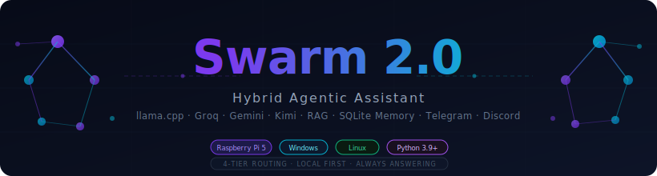
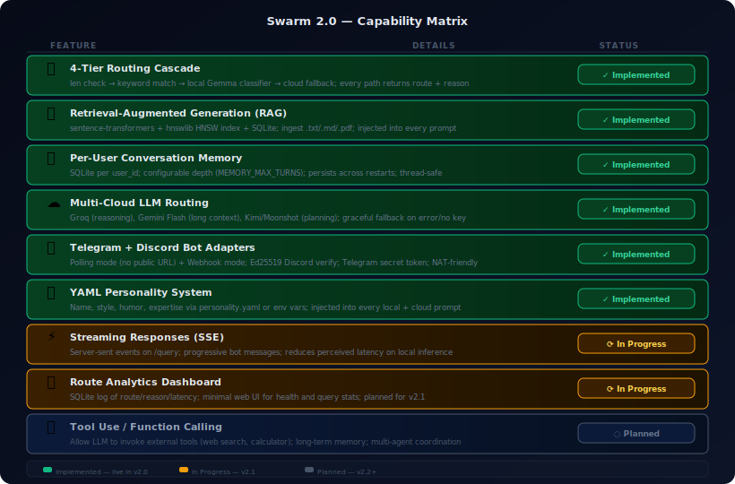
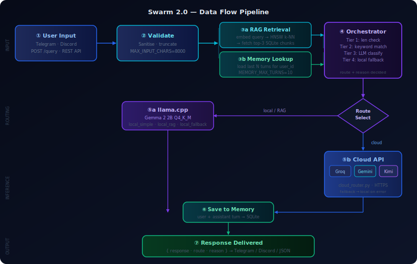

<!-- README.md — Swarm 2.0 -->
<div align="center">



</div>

**Local-first hybrid AI assistant that routes every message through a 4-tier cascade — because the cloud shouldn't be the default answer to everything.**

[Features](#features) • [Installation](#installation) • [Usage](#usage) • [Architecture](#architecture) • [Roadmap](#roadmap) • [License](#license)

---

*I built this because I wanted a personal assistant that actually runs on my own hardware, doesn't send everything to OpenAI, and still has access to real reasoning power when the question actually needs it. The Pi 5 sitting on my desk shouldn't need a $20/month API bill just to answer "what's the weather" — but it should be able to call Groq when I ask it to dissect a codebase.*

**Swarm 2.0** is a production-ready, privacy-first hybrid AI assistant built in Python. It runs on a **Raspberry Pi 5** or **Windows** machine, routes each message through a **4-tier decision cascade** — length check, keyword fast-path, on-device LLM classifier, and cloud fallback — and enriches every response with **local RAG** (retrieval-augmented generation from your own documents) and **per-user SQLite conversation memory**. The local model is Gemma 2 2B via llama.cpp. The cloud backends are Groq (reasoning), Gemini Flash (long context), and Kimi/Moonshot (planning). All three are optional; the thing works offline.

---

<div align="center">

[](https://www.python.org/)
[](https://fastapi.tiangolo.com/)
[](https://github.com/ggerganov/llama.cpp)
[](wiki/Installation.md)
[](LICENSE)
[](docs/API_REFERENCE.md)
[](wiki/Architecture.md)

</div>

---

## System Overview

Swarm 2.0 is a single-process FastAPI application. Everything — the local LLM subprocess, vector store, conversation memory, bot polling loops, and cloud clients — lives inside one Uvicorn worker. That's a deliberate choice: SQLite is not safe across OS processes, and a Pi 5 doesn't need horizontal scaling at the API level.

```
Swarm2.0/
├── agentic_assistant/
│   ├── src/assistant/
│   │   ├── agent.py              # entry point — starts Uvicorn
│   │   ├── api.py                # FastAPI app + endpoint definitions
│   │   ├── orchestrator.py       # 4-tier routing engine
│   │   ├── config.py             # dotenv Settings dataclass
│   │   ├── memory.py             # per-user SQLite conversation store
│   │   ├── personality.py        # YAML/env personality loader
│   │   ├── llm/
│   │   │   ├── llama_cpp_runner.py   # subprocess wrapper for llama-cli
│   │   │   └── cloud_router.py       # Groq · Gemini · Kimi clients
│   │   ├── rag/
│   │   │   └── store.py          # HNSW index + SQLite metadata
│   │   ├── bots/
│   │   │   ├── telegram_polling.py   # async long-poll Telegram adapter
│   │   │   └── discord_bot.py        # Discord gateway + webhook adapter
│   │   └── messaging/
│   │       ├── parsers.py        # extract (user_id, text) from payloads
│   │       └── senders.py        # deliver responses to platforms
│   ├── data/knowledge/           # drop .txt/.md/.pdf here for ingestion
│   ├── deploy/
│   │   ├── agent.service         # systemd unit (Pi/Linux)
│   │   ├── nginx-agent.conf      # Nginx reverse proxy config
│   │   ├── install_pi.sh         # Pi 5 bootstrap script
│   │   └── install_windows.ps1   # Windows bootstrap script
│   ├── scripts/
│   │   ├── ingest_documents.py   # CLI: index documents into RAG store
│   │   └── test_agent_end_to_end.py  # smoke test
│   ├── .env.example              # documented environment variable template
│   ├── requirements.txt          # 20 pinned dependencies
│   └── pyproject.toml
├── docs/
│   ├── API_REFERENCE.md          # REST endpoint reference
│   └── CONFIGURATION.md          # full .env annotated reference
├── wiki/                         # extended guides
└── assets/                       # SVG diagrams referenced in this README
```

The orchestrator is the only component allowed to make routing decisions. `api.py` accepts requests, `orchestrator.py` decides what to do with them, and the bot adapters just translate platform payloads.


---

## Features

| Feature | What it actually does |
|---|---|
| 🧠 **4-Tier Routing** | Evaluates every message through: length threshold → keyword signals → local Gemma classifier → cloud fallback. Each response includes `route` and `reason` fields. |
| 📚 **Local RAG** | Chunks and embeds your `.txt`/`.md`/`.pdf` documents with `sentence-transformers`, indexes them in hnswlib HNSW, and injects the top-3 relevant passages into every prompt — local and cloud alike. |
| 💬 **Conversation Memory** | Stores per-user conversation turns in SQLite, keyed by `user_id`. Loads the last `MEMORY_MAX_TURNS` turns and prepends them as chat history. Survives restarts. |
| ☁️ **Multi-Cloud Routing** | Groq for step-by-step reasoning, Gemini Flash for messages over 1,200 characters, Kimi/Moonshot for planning and roadmap queries. Missing a key? That backend is silently skipped. |
| 🤖 **Telegram + Discord** | Polling mode needs no public URL — works behind NAT on a Pi or a Windows machine. Webhook mode available for public servers. Discord interactions verified with Ed25519/PyNaCl. |
| 🎭 **Personality System** | Define your assistant's name, tone, humor, and expertise in `personality.yaml` or environment variables. The system prompt is injected into every inference call without touching code. |
| ⚡ **FastAPI REST API** | `POST /query`, `GET /health`, `POST /webhook/telegram`, `POST /webhook/discord`. The response JSON always includes `route`, `reason`, and `response`. |
| 🔒 **Privacy First** | No cloud keys = zero network traffic from the AI pipeline. Conversation history never leaves the device. API keys are never logged. |
| 🖥️ **Cross-Platform Deploy** | systemd + Nginx on Pi/Linux. PowerShell scripts + Task Scheduler on Windows. Same codebase, same `.env` format. |
| 🔀 **Explainable Routing** | Every response tells you which backend handled it and why — `local_simple`, `groq`, `kw_reasoning`, `llm_classifier`, etc. No black box. |

---

## Capability Visualization



---

## Architecture


The entire application runs as a **single Uvicorn worker**. SQLite uses a per-thread connection model, not a process-safe one — running `--workers 2` would corrupt your conversation store within minutes. This constraint also means the bot polling loops, the Uvicorn event loop, and the llama.cpp subprocess all share the same OS process, which keeps the resource footprint low enough to run on 8 GB of RAM without evicting anything.

The orchestrator pattern keeps routing logic in one place: `orchestrator.py` owns all tier decisions, prompt construction, RAG injection, memory reads, and memory writes. Nothing in `api.py` or the bot adapters touches routing logic. This makes the cascade easy to test in isolation and easy to extend — adding a new cloud provider is a matter of adding a method to `CloudRouter` and a branch in `_route()`.

---

## Data Flow



Primary data path from message receipt to response delivery:

```
User message (Telegram / Discord / POST /query)
    │
    ├── [api.py] validate + sanitise (MAX_INPUT_CHARS = 8000)
    │
    ├── [orchestrator] fetch RAG context (top-3 HNSW k-NN chunks)
    ├── [orchestrator] load conversation history (last 10 turns, SQLite)
    │
    ├── [orchestrator] Tier 1: len(msg) ≤ 150 AND no complex signal?
    │       └── YES → llama.cpp local  (reason: short_message)
    │
    ├── [orchestrator] Tier 2: keyword match?
    │       ├── plan/roadmap/strategy  → Kimi     (reason: kw_planning)
    │       ├── len ≥ 1200             → Gemini   (reason: kw_long_context)
    │       ├── analyze/compare/…      → Groq     (reason: kw_reasoning)
    │       └── docs/document/…        → local    (reason: kw_rag)
    │
    ├── [orchestrator] Tier 3: Gemma classifies → LOCAL / GROQ / GEMINI / KIMI
    │       └── failure / LOCAL → llama.cpp     (reason: llm_classifier_local)
    │
    └── [orchestrator] Tier 4: cloud call fails or key missing
            └── llama.cpp fallback               (reason: *_unavailable)
                │
                ├── save turn to SQLite memory
                └── return { response · route · reason }
```

---

## Installation

### Prerequisites

- **Python 3.9+** — the type hints and dataclasses used here need it
- **llama.cpp** — built from source; provides the `llama-cli` binary for local inference
- **Gemma 2 2B Q4_K_M** model file (`.gguf`) — download from HuggingFace

### 1. Raspberry Pi 5 / Linux

```bash
# Clone and enter the assistant directory
git clone https://github.com/Kaelith69/Swarm2.0.git
cd Swarm2.0/agentic_assistant

# Run the Pi bootstrap script (installs system deps, builds llama.cpp, creates venv)
bash deploy/install_pi.sh

# Copy and secure the environment file
cp .env.example .env
chmod 600 .env

# Edit .env — minimum required fields:
#   MODEL_PATH=/home/pi/models/gemma-2-2b-it-Q4_K_M.gguf
#   LLAMA_MAIN_PATH=/home/pi/llama.cpp/build/bin/llama-cli
nano .env

# Start the assistant (starts the FastAPI server + bot pollers)
bash scripts/pi_start_and_check.sh
```

> **Why `chmod 600`?** Your `.env` contains API keys and bot tokens. If it's world-readable, any user on the system can read them. Do this before putting any real keys in the file.

### 2. Windows (PowerShell)

```powershell
git clone https://github.com/Kaelith69/Swarm2.0.git
cd Swarm2.0\agentic_assistant

# Bootstrap: installs Python deps, builds or locates llama.cpp, creates venv
powershell -ExecutionPolicy Bypass -File deploy\install_windows.ps1

# Edit .env with Notepad (or VS Code)
notepad .env

# Start server + bots
powershell -ExecutionPolicy Bypass -File scripts\start_windows.ps1
```

### 3. Platform comparison

| Step | Pi 5 / Linux | Windows |
|---|---|---|
| llama.cpp build | `cmake` via install_pi.sh | Pre-built binary or build manually |
| Process manager | systemd (`deploy/agent.service`) | Task Scheduler |
| Reverse proxy | Nginx (`deploy/nginx-agent.conf`) | Needs ngrok for public webhooks |
| Bot polling | Works as-is | Works as-is |
| Virtual env | `.venv` created by install script | `.venv` created by install script |

### 4. Verify

```bash
curl http://127.0.0.1:8000/health
# → {"ok":true,"agent_name":"Assistant","bot_mode":"polling","hybrid":{...}}

curl -X POST http://127.0.0.1:8000/query \
  -H "Content-Type: application/json" \
  -d '{"message": "Hello"}'
# → {"route":"local_simple","reason":"short_message","response":"..."}
```

---

## Usage

### Primary workflow

1. Start the server: `bash scripts/pi_start_and_check.sh` (or the Windows equivalent)
2. Send a message to your Telegram or Discord bot, or `POST /query` directly
3. The response JSON includes `route` and `reason` — use these to tune your routing thresholds
4. Ingest your documents: drop `.txt`/`.md`/`.pdf` files in `data/knowledge/`, then run the ingestion script
5. The assistant will automatically pull relevant context from those documents for every subsequent query

### Ingest documents

```bash
# Linux / Pi
export PYTHONPATH=src
python scripts/ingest_documents.py data/knowledge --source knowledge_base

# Windows (PowerShell)
$env:PYTHONPATH = "src"
.\.venv\Scripts\python.exe scripts\ingest_documents.py data\knowledge --source knowledge_base
```

### Key environment variables

```env
# Local model (required for any local inference)
MODEL_PATH=/home/pi/models/gemma-2-2b-it-Q4_K_M.gguf
LLAMA_MAIN_PATH=/home/pi/llama.cpp/build/bin/llama-cli

# Bot mode — "polling" works behind NAT; "webhook" needs a public HTTPS URL
BOT_MODE=polling

# Cloud API keys — leave blank to disable that route entirely
GROQ_API_KEY=
GEMINI_API_KEY=
KIMI_API_KEY=

# Bot tokens
TELEGRAM_BOT_TOKEN=
DISCORD_BOT_TOKEN=

# Personality
AGENT_NAME=Aria
AGENT_PERSONALITY=curious, direct, and occasionally sarcastic
```

> **Pro tip:** Set `USE_LLM_ROUTING=false` if you're running on constrained hardware and want deterministic keyword-only routing without the overhead of running Gemma to classify ambiguous messages. You'll lose Tier 3 routing intelligence but save roughly 2–3 seconds per ambiguous query.

See [docs/CONFIGURATION.md](docs/CONFIGURATION.md) for the full annotated reference.

---

## Project Structure

```
agentic_assistant/
├── 🚀 src/assistant/
│   ├── agent.py              # Uvicorn entry point — single worker ONLY
│   ├── api.py                # FastAPI app, startup hooks, all 4 endpoints
│   ├── orchestrator.py       # The whole routing brain — don't split this
│   ├── config.py             # Frozen Settings dataclass, loaded from .env
│   ├── memory.py             # SQLite-backed per-user turn store
│   ├── personality.py        # YAML-first, env-fallback personality loader
│   ├── 🤖 llm/
│   │   ├── llama_cpp_runner.py   # Spawns llama-cli subprocess, parses stdout
│   │   └── cloud_router.py       # groq · google-generativeai · openai (Kimi)
│   ├── 📚 rag/
│   │   └── store.py              # hnswlib HNSW + SQLite, chunk ingest + query
│   ├── 💬 bots/
│   │   ├── telegram_polling.py   # httpx async poller, no webhook needed
│   │   └── discord_bot.py        # discord.py gateway, Ed25519 interaction verify
│   └── 📨 messaging/
│       ├── parsers.py            # platform payload → (user_id, text)
│       └── senders.py            # text → platform response call
├── 📂 data/knowledge/        # knowledge base documents (gitignored content)
├── ⚙️ deploy/
│   ├── agent.service         # systemd unit file
│   ├── nginx-agent.conf      # Nginx TLS proxy config
│   ├── install_pi.sh         # Pi 5 full setup (Python, llama.cpp, venv)
│   └── install_windows.ps1   # Windows full setup
├── 🔧 scripts/
│   ├── ingest_documents.py       # index .txt/.md/.pdf into RAG store
│   ├── test_agent_end_to_end.py  # smoke test — must pass before PR
│   ├── pi_start_and_check.sh     # start server + verify /health
│   └── start_windows.ps1         # Windows equivalent
├── .env.example              # every config var documented with defaults
├── personality.yaml.example  # personality config template
└── requirements.txt          # 20 pinned production dependencies
```

---

## Performance Stats


Local inference latency depends heavily on your hardware and model quantization:

| Hardware | Model | Avg first-token latency |
|---|---|---|
| Raspberry Pi 5 (8GB) | Gemma 2 2B Q4_K_M | ~2–4 s |
| Windows (modern CPU) | Gemma 2 2B Q4_K_M | ~1–2 s |
| Cloud (Groq) | llama-3.1-8b-instant | ~0.3–0.8 s |

> These are rough estimates under normal load. `INFERENCE_THREADS` defaults to `cpu_count - 1`; on the Pi 5 (4 cores) that means 3 threads. Setting it to 4 may reduce latency by ~10% at the cost of occasional thermal throttling.

---

## Privacy

**What stays on your device, always:**
- Conversation history (SQLite, `RAG_DATA_DIR`)
- Document embeddings and RAG index (HNSW + SQLite)
- API keys and bot tokens (`.env`)
- LLM inference when using local routes

**What leaves your device (only if you configure it):**
- Messages routed to Groq, Gemini, or Kimi — sent over HTTPS to those providers' APIs
- The routing cascade is transparent: every response includes `route` and `reason` so you always know which backend handled a message

**To verify full local-only operation:** ensure `GROQ_API_KEY`, `GEMINI_API_KEY`, and `KIMI_API_KEY` are all empty in your `.env`. The system will never call a cloud API if the key is absent.

See [wiki/Privacy.md](wiki/Privacy.md) for the full data inventory and security hardening guide.

---

## Roadmap

### v2.0 — Shipped ✅

- [x] 4-tier routing cascade (length → keyword → LLM classifier → fallback)
- [x] Local inference via llama.cpp (Gemma 2 2B Q4_K_M)
- [x] Groq, Gemini Flash, Kimi cloud integrations
- [x] RAG: sentence-transformers + hnswlib + SQLite
- [x] Per-user conversation memory (SQLite)
- [x] Telegram bot (polling + webhook)
- [x] Discord bot (gateway + interactions webhook, Ed25519 verify)
- [x] YAML personality system
- [x] FastAPI REST (`/query`, `/health`, `/webhook/*`)
- [x] Raspberry Pi 5 deploy (systemd + Nginx)
- [x] Windows deploy (PowerShell scripts + Task Scheduler)
- [x] Document ingestion CLI (.txt/.md/.pdf)
- [x] Explainable routing (route + reason in every response)

### v2.1 — In Progress 🔄

- [ ] Streaming responses (SSE on `/query`; progressive bot messages)
- [ ] Route analytics dashboard (SQLite log of route/reason/latency)
- [ ] Web UI for health, recent queries, and routing stats
- [ ] Per-user RAG namespacing (isolated knowledge bases per user_id)
- [ ] Configurable RAG chunk size (`CHUNK_SIZE`, `CHUNK_OVERLAP` in `.env`)

### v2.2+ — Planned 💡

- [ ] Additional cloud providers: Anthropic Claude, Mistral, OpenAI
- [ ] Voice/TTS output for Discord voice channels
- [ ] Multi-agent swarm coordination via message bus
- [ ] Semantic long-term memory (beyond conversation turns)
- [ ] Tool use / function calling (web search, calculator)
- [ ] On-device LoRA fine-tuning on Pi 5
- [ ] Docker / OCI container image
- [ ] Slack and Teams bot adapters

---

## Packaging

To deploy as a standalone systemd service on Pi/Linux:

```bash
cd Swarm2.0/agentic_assistant
sudo cp deploy/agent.service /etc/systemd/system/swarm-assistant.service
sudo systemctl daemon-reload
sudo systemctl enable swarm-assistant
sudo systemctl start swarm-assistant
sudo journalctl -u swarm-assistant -f
```

To run as a Windows background service via Task Scheduler:

```powershell
$action = New-ScheduledTaskAction -Execute "powershell.exe" `
  -Argument "-File scripts\start_windows.ps1" `
  -WorkingDirectory (Get-Location).Path
$trigger = New-ScheduledTaskTrigger -AtLogOn
Register-ScheduledTask -TaskName "SwarmAssistant" -Action $action -Trigger $trigger -RunLevel Highest
```

---

## Contributing

Read [CONTRIBUTING.md](CONTRIBUTING.md) before opening a PR.

Hard rules:
- **Single Uvicorn worker only** — `--workers N` with N > 1 will corrupt the SQLite stores.
- **Cloud is always optional** — every code path must fall back gracefully when cloud keys are absent.
- **Routing logic belongs in `orchestrator.py`** — no routing decisions in `api.py` or bot adapters.
- `pyright src/` must exit cleanly.
- `python scripts/test_agent_end_to_end.py` must pass.

---

## Security

Report vulnerabilities via [SECURITY.md](SECURITY.md). Do not open a public GitHub issue for security bugs.

---

## License

[MIT](LICENSE) © 2025 Kaelith69 — built on a Pi 5, tested at 3am, runs in production.
