<div align="center">

<!-- Project Banner SVG -->
<svg xmlns="http://www.w3.org/2000/svg" viewBox="0 0 900 200" width="900" height="200">
  <defs>
    <linearGradient id="bgGrad" x1="0%" y1="0%" x2="100%" y2="100%">
      <stop offset="0%" style="stop-color:#0f0f23;stop-opacity:1" />
      <stop offset="100%" style="stop-color:#1a1a3e;stop-opacity:1" />
    </linearGradient>
    <linearGradient id="textGrad" x1="0%" y1="0%" x2="100%" y2="0%">
      <stop offset="0%" style="stop-color:#7c3aed;stop-opacity:1" />
      <stop offset="50%" style="stop-color:#06b6d4;stop-opacity:1" />
      <stop offset="100%" style="stop-color:#10b981;stop-opacity:1" />
    </linearGradient>
    <filter id="glow">
      <feGaussianBlur stdDeviation="3" result="coloredBlur"/>
      <feMerge>
        <feMergeNode in="coloredBlur"/>
        <feMergeNode in="SourceGraphic"/>
      </feMerge>
    </filter>
  </defs>
  <!-- Background -->
  <rect width="900" height="200" fill="url(#bgGrad)" rx="12"/>
  <!-- Decorative circuit lines -->
  <line x1="0" y1="40" x2="120" y2="40" stroke="#7c3aed" stroke-width="1" opacity="0.4"/>
  <line x1="120" y1="40" x2="140" y2="20" stroke="#7c3aed" stroke-width="1" opacity="0.4"/>
  <circle cx="140" cy="20" r="3" fill="#7c3aed" opacity="0.6"/>
  <line x1="780" y1="160" x2="900" y2="160" stroke="#10b981" stroke-width="1" opacity="0.4"/>
  <line x1="760" y1="180" x2="780" y2="160" stroke="#10b981" stroke-width="1" opacity="0.4"/>
  <circle cx="760" cy="180" r="3" fill="#10b981" opacity="0.6"/>
  <!-- Hexagons decoration -->
  <polygon points="820,30 840,20 860,30 860,50 840,60 820,50" fill="none" stroke="#06b6d4" stroke-width="1" opacity="0.3"/>
  <polygon points="40,150 60,140 80,150 80,170 60,180 40,170" fill="none" stroke="#7c3aed" stroke-width="1" opacity="0.3"/>
  <!-- Main title -->
  <text x="450" y="100" font-family="'Segoe UI', Arial, sans-serif" font-size="56" font-weight="900"
        text-anchor="middle" fill="url(#textGrad)" filter="url(#glow)">Swarm 2.0</text>
  <!-- Subtitle -->
  <text x="450" y="140" font-family="'Segoe UI', Arial, sans-serif" font-size="18" font-weight="400"
        text-anchor="middle" fill="#94a3b8">Hybrid Agentic Assistant · Edge AI · Raspberry Pi 5</text>
  <!-- Node dots -->
  <circle cx="200" cy="100" r="4" fill="#7c3aed" opacity="0.7" filter="url(#glow)"/>
  <circle cx="700" cy="100" r="4" fill="#10b981" opacity="0.7" filter="url(#glow)"/>
  <circle cx="160" cy="80" r="2" fill="#06b6d4" opacity="0.5"/>
  <circle cx="740" cy="120" r="2" fill="#06b6d4" opacity="0.5"/>
  <line x1="200" y1="100" x2="160" y2="80" stroke="#06b6d4" stroke-width="1" opacity="0.3"/>
  <line x1="700" y1="100" x2="740" y2="120" stroke="#06b6d4" stroke-width="1" opacity="0.3"/>
</svg>

<br/>

[](https://python.org)
[](https://fastapi.tiangolo.com)
[](https://www.raspberrypi.com)
[](https://github.com/ggerganov/llama.cpp)
[](LICENSE)

<br/>

**Swarm 2.0** is a production-ready hybrid AI assistant that intelligently routes queries between on-device LLM inference and cloud providers — running on a Raspberry Pi 5.

[Quick Start](#-quick-start) · [Architecture](#-architecture) · [Configuration](#-configuration) · [API Reference](#-api-reference) · [Deployment](#-deployment)

</div>

---

## 📋 Table of Contents

- [Overview](#-overview)
- [Architecture](#-architecture)
  - [System Architecture](#system-architecture)
  - [Request Routing Flow](#request-routing-flow)
  - [Component Interaction](#component-interaction)
  - [RAG Pipeline](#rag-pipeline)
- [Hardware Setup](#-hardware-setup)
- [Project Structure](#-project-structure)
- [Quick Start](#-quick-start)
- [Configuration](#-configuration)
  - [Environment Variables](#environment-variables)
  - [Cloud Providers](#cloud-providers)
  - [Messaging Platforms](#messaging-platforms)
- [API Reference](#-api-reference)
- [RAG — Knowledge Ingestion](#-rag--knowledge-ingestion)
- [Deployment](#-deployment)
  - [Systemd Service](#systemd-service)
  - [Nginx Reverse Proxy](#nginx-reverse-proxy)
- [Performance Tuning](#-performance-tuning)
- [Security](#-security)
- [Troubleshooting](#-troubleshooting)

---

## 🌟 Overview

Swarm 2.0 is a **hybrid agentic assistant** designed to run efficiently on edge hardware (Raspberry Pi 5) while seamlessly delegating complex tasks to cloud AI providers. It features:

| Capability | Details |
|---|---|
| 🧠 **Local Inference** | `llama.cpp` with quantized GGUF models (e.g., Gemma 2 2B Q4_K_M) |
| 📚 **Local RAG** | `sentence-transformers` + `hnswlib` vector store + `SQLite` metadata |
| ⚡ **Cloud Routing** | Groq (reasoning) · Gemini (long context) · Kimi/Moonshot (planning) |
| 🔌 **Webhooks** | Telegram · Discord · WhatsApp Cloud API |
| 🌐 **API** | FastAPI REST interface with explainability (`route` + `reason`) |
| 🔄 **Failsafe** | Automatic cloud → local fallback on errors or missing keys |

---

## 🏗 Architecture

### System Architecture


---

### Request Routing Flow


---

### Component Interaction


---

### RAG Pipeline


---

## 🔧 Hardware Setup

<!-- Hardware Setup SVG Diagram -->
<div align="center">
<svg xmlns="http://www.w3.org/2000/svg" viewBox="0 0 820 440" width="820" height="440">
  <defs>
    <linearGradient id="piGrad" x1="0%" y1="0%" x2="100%" y2="100%">
      <stop offset="0%" style="stop-color:#166534;stop-opacity:1"/>
      <stop offset="100%" style="stop-color:#15803d;stop-opacity:1"/>
    </linearGradient>
    <linearGradient id="ssdGrad" x1="0%" y1="0%" x2="100%" y2="100%">
      <stop offset="0%" style="stop-color:#1e3a5f;stop-opacity:1"/>
      <stop offset="100%" style="stop-color:#1d4ed8;stop-opacity:1"/>
    </linearGradient>
    <linearGradient id="psuGrad" x1="0%" y1="0%" x2="100%" y2="100%">
      <stop offset="0%" style="stop-color:#7c2d12;stop-opacity:1"/>
      <stop offset="100%" style="stop-color:#b91c1c;stop-opacity:1"/>
    </linearGradient>
    <linearGradient id="bgDark" x1="0%" y1="0%" x2="0%" y2="100%">
      <stop offset="0%" style="stop-color:#0f172a;stop-opacity:1"/>
      <stop offset="100%" style="stop-color:#1e293b;stop-opacity:1"/>
    </linearGradient>
  </defs>

  <!-- Background -->
  <rect width="820" height="440" fill="url(#bgDark)" rx="16"/>
  <text x="410" y="36" font-family="'Segoe UI', Arial, sans-serif" font-size="20" font-weight="700"
        text-anchor="middle" fill="#e2e8f0">Hardware Reference Setup</text>

  <!-- Raspberry Pi 5 Board -->
  <rect x="260" y="120" width="300" height="200" rx="10" fill="url(#piGrad)" stroke="#4ade80" stroke-width="2"/>
  <text x="410" y="148" font-family="monospace" font-size="13" font-weight="700" text-anchor="middle" fill="#dcfce7">Raspberry Pi 5</text>
  <text x="410" y="164" font-family="monospace" font-size="11" text-anchor="middle" fill="#86efac">8 GB LPDDR4X RAM</text>
  <!-- CPU die -->
  <rect x="360" y="175" width="100" height="70" rx="4" fill="#052e16" stroke="#22c55e" stroke-width="1.5"/>
  <text x="410" y="198" font-family="monospace" font-size="10" text-anchor="middle" fill="#4ade80">BCM2712</text>
  <text x="410" y="212" font-family="monospace" font-size="9" text-anchor="middle" fill="#86efac">Cortex-A76</text>
  <text x="410" y="226" font-family="monospace" font-size="9" text-anchor="middle" fill="#86efac">4-core · 2.4GHz</text>
  <text x="410" y="240" font-family="monospace" font-size="9" text-anchor="middle" fill="#86efac">arm64</text>
  <!-- GPIO pins strip -->
  <rect x="268" y="128" width="5" height="180" rx="2" fill="#fbbf24"/>
  <text x="263" y="220" font-family="monospace" font-size="9" text-anchor="middle" fill="#fbbf24" transform="rotate(-90,263,220)">GPIO 40-pin</text>
  <!-- M.2 connector bottom -->
  <rect x="310" y="310" width="200" height="8" rx="2" fill="#059669" stroke="#4ade80" stroke-width="1"/>
  <text x="410" y="308" font-family="monospace" font-size="9" text-anchor="middle" fill="#4ade80">PCIe M.2 Key M</text>
  <!-- USB ports -->
  <rect x="550" y="145" width="8" height="50" rx="2" fill="#374151" stroke="#9ca3af" stroke-width="1"/>
  <rect x="550" y="205" width="8" height="50" rx="2" fill="#374151" stroke="#9ca3af" stroke-width="1"/>
  <text x="565" y="215" font-family="monospace" font-size="9" fill="#9ca3af">USB 3.0</text>
  <!-- Ethernet -->
  <rect x="550" y="270" width="8" height="30" rx="2" fill="#374151" stroke="#9ca3af" stroke-width="1"/>
  <text x="565" y="290" font-family="monospace" font-size="9" fill="#9ca3af">GbE</text>
  <!-- Fan -->
  <circle cx="410" cy="100" r="18" fill="#1e1b4b" stroke="#818cf8" stroke-width="1.5"/>
  <line x1="410" y1="84" x2="410" y2="116" stroke="#818cf8" stroke-width="1.5"/>
  <line x1="394" y1="100" x2="426" y2="100" stroke="#818cf8" stroke-width="1.5"/>
  <line x1="398" y1="88" x2="422" y2="112" stroke="#818cf8" stroke-width="1" opacity="0.6"/>
  <line x1="422" y1="88" x2="398" y2="112" stroke="#818cf8" stroke-width="1" opacity="0.6"/>
  <text x="410" y="78" font-family="monospace" font-size="9" text-anchor="middle" fill="#818cf8">Active Fan</text>

  <!-- NVMe SSD -->
  <rect x="80" y="280" width="160" height="100" rx="8" fill="url(#ssdGrad)" stroke="#60a5fa" stroke-width="2"/>
  <text x="160" y="303" font-family="monospace" font-size="12" font-weight="700" text-anchor="middle" fill="#bfdbfe">NVMe SSD</text>
  <text x="160" y="320" font-family="monospace" font-size="10" text-anchor="middle" fill="#93c5fd">≥ 128 GB</text>
  <text x="160" y="335" font-family="monospace" font-size="9" text-anchor="middle" fill="#93c5fd">M.2 2242/2280</text>
  <text x="160" y="350" font-family="monospace" font-size="9" text-anchor="middle" fill="#93c5fd">models/ · data/rag/</text>
  <!-- connector line to Pi -->
  <line x1="240" y1="330" x2="310" y2="318" stroke="#60a5fa" stroke-width="2" stroke-dasharray="6,3"/>

  <!-- USB-C PSU -->
  <rect x="580" y="280" width="160" height="100" rx="8" fill="url(#psuGrad)" stroke="#f87171" stroke-width="2"/>
  <text x="660" y="303" font-family="monospace" font-size="12" font-weight="700" text-anchor="middle" fill="#fecaca">USB-C PSU</text>
  <text x="660" y="320" font-family="monospace" font-size="10" text-anchor="middle" fill="#fca5a5">Official 27W</text>
  <text x="660" y="335" font-family="monospace" font-size="9" text-anchor="middle" fill="#fca5a5">5V / 5A</text>
  <text x="660" y="350" font-family="monospace" font-size="9" text-anchor="middle" fill="#fca5a5">Prevents throttling</text>
  <!-- connector line to Pi -->
  <line x1="580" y1="330" x2="558" y2="285" stroke="#f87171" stroke-width="2" stroke-dasharray="6,3"/>

  <!-- Labels at bottom -->
  <text x="160" y="400" font-family="'Segoe UI', Arial, sans-serif" font-size="11" text-anchor="middle" fill="#60a5fa">① Models + RAG on NVMe</text>
  <text x="410" y="400" font-family="'Segoe UI', Arial, sans-serif" font-size="11" text-anchor="middle" fill="#4ade80">② Pi 5 runs llama.cpp + FastAPI</text>
  <text x="660" y="400" font-family="'Segoe UI', Arial, sans-serif" font-size="11" text-anchor="middle" fill="#f87171">③ 27W PSU avoids undervolt</text>

  <!-- Temperature warning -->
  <rect x="340" y="56" width="140" height="22" rx="4" fill="#78350f" stroke="#fbbf24" stroke-width="1"/>
  <text x="410" y="71" font-family="monospace" font-size="10" text-anchor="middle" fill="#fde68a">🌡 Monitor: vcgencmd measure_temp</text>
</svg>
</div>

### Recommended Bill of Materials

| Component | Specification | Notes |
|---|---|---|
| **SBC** | Raspberry Pi 5 (8 GB) | 8 GB variant required for comfortable LLM inference |
| **Storage** | NVMe SSD ≥ 128 GB (M.2 Key M) | Use Pi 5 M.2 HAT or NVMe Base; improves model I/O dramatically |
| **Power Supply** | Official Raspberry Pi 27W USB-C PSU | Prevents under-voltage → CPU throttling during inference |
| **Cooling** | Active cooler (fan + heatsink) | Required for sustained inference without thermal throttling |
| **OS** | Ubuntu Server 24.04 LTS ARM64 | Stable, well-supported, easy llama.cpp build environment |

---

## 📁 Project Structure

```
Swarm2.0/
└── agentic_assistant/
    ├── src/
    │   └── assistant/
    │       ├── __init__.py
    │       ├── agent.py            ← Entry point (uvicorn runner)
    │       ├── api.py              ← FastAPI app, all HTTP endpoints
    │       ├── config.py           ← Settings from .env / environment
    │       ├── orchestrator.py     ← AgentOrchestrator: routing logic
    │       ├── llm/
    │       │   ├── __init__.py
    │       │   ├── llama_cpp_runner.py   ← Local llama.cpp subprocess runner
    │       │   └── cloud_router.py       ← Groq / Gemini / Kimi clients
    │       ├── rag/
    │       │   ├── __init__.py
    │       │   └── store.py        ← RagStore: hnswlib + SQLite
    │       └── messaging/
    │           ├── __init__.py
    │           ├── parsers.py      ← Parse Telegram / Discord / WhatsApp payloads
    │           └── senders.py      ← Send replies via bot APIs
    ├── scripts/
    │   ├── ingest_documents.py     ← CLI tool to ingest docs into RAG
    │   ├── test_agent_end_to_end.py
    │   ├── check_langchain_docs_mcp.py
    │   ├── pi_start_and_check.sh   ← One-command start + health check (Pi)
    │   ├── publish_to_github.sh
    │   └── publish_to_github.ps1
    ├── deploy/
    │   ├── install_pi.sh           ← Bootstrap installer for Raspberry Pi
    │   ├── agent.service           ← systemd unit file
    │   └── nginx-agent.conf        ← Nginx reverse-proxy config
    ├── docs/
    │   └── pi_setup.md
    ├── .env.example                ← All configurable variables with defaults
    ├── .gitignore
    ├── pyproject.toml
    ├── requirements.txt
    ├── README.md
    ├── GUIDE.md                    ← Extended operational guide
    └── LANGCHAIN_DOCS_MCP_GUIDE.md
```

---

## 🚀 Quick Start

### Prerequisites

- Python 3.11+
- `llama.cpp` built from source with `llama-cli` binary
- A quantized GGUF model (see [Models](#models))
- (Optional) Cloud API keys for Groq / Gemini / Kimi

### 1 — Clone and install dependencies

```bash
git clone https://github.com/Kaelith69/Swarm2.0.git
cd Swarm2.0/agentic_assistant

python -m venv .venv
source .venv/bin/activate          # Windows: .venv\Scripts\Activate.ps1
pip install --upgrade pip
pip install -r requirements.txt
```

### 2 — Configure environment

```bash
cp .env.example .env
chmod 600 .env          # restrict permissions
nano .env               # set MODEL_PATH, LLAMA_MAIN_PATH, and any API keys
```

Minimum required values:

```dotenv
MODEL_PATH=/home/ubuntu/models/gemma-2-2b-it-Q4_K_M.gguf
LLAMA_MAIN_PATH=/home/ubuntu/llama.cpp/build/bin/llama-cli
```

### 3 — Run the server

```bash
export PYTHONPATH=src
python -m assistant.agent
# → Uvicorn started on http://0.0.0.0:8000
```

### 4 — Verify it works

```bash
# Health check
curl http://127.0.0.1:8000/health

# Send a query
curl -X POST http://127.0.0.1:8000/query \
  -H "Content-Type: application/json" \
  -d '{"message": "What is the capital of France?"}'
```

**Expected response:**
```json
{
  "route": "local_simple",
  "reason": "default_simple",
  "response": "The capital of France is Paris."
}
```

### 5 — Raspberry Pi one-liner

```bash
bash scripts/pi_start_and_check.sh
```

---

## ⚙️ Configuration

### Environment Variables

All configuration is done via `.env` (copy from `.env.example`). The table below documents every variable:

#### Core Runtime

| Variable | Default | Description |
|---|---|---|
| `HOST` | `0.0.0.0` | Uvicorn bind host |
| `PORT` | `8000` | Uvicorn bind port |
| `MODEL_PATH` | `/home/ubuntu/models/gemma2b.gguf` | Absolute path to the GGUF model file |
| `LLAMA_MAIN_PATH` | `/home/ubuntu/llama.cpp/build/bin/llama-cli` | Absolute path to the `llama-cli` binary |

#### Inference Tuning

| Variable | Default | Description |
|---|---|---|
| `INFERENCE_THREADS` | `4` (auto-detected) | Number of CPU threads for llama.cpp; start at 2–4 on Pi 5 |
| `LLM_CONTEXT_TOKENS` | `2048` | Context window size; larger uses more RAM |
| `MAX_RESPONSE_TOKENS` | `256` | Maximum tokens to generate per response |
| `LLM_TEMPERATURE` | `0.2` | Sampling temperature (0 = deterministic, 1 = creative) |

#### RAG Settings

| Variable | Default | Description |
|---|---|---|
| `EMBEDDING_MODEL` | `sentence-transformers/all-MiniLM-L6-v2` | HuggingFace embedding model |
| `RAG_TOP_K` | `3` | Number of chunks to retrieve per query |
| `RAG_DATA_DIR` | `./data/rag` | Directory for hnswlib index + SQLite DB; use NVMe path on Pi |

#### Routing Thresholds

| Variable | Default | Description |
|---|---|---|
| `LONG_CONTEXT_THRESHOLD_CHARS` | `1200` | Messages longer than this are sent to Gemini |
| `CLOUD_TIMEOUT_SECONDS` | `25` | HTTP timeout for cloud API calls |
| `MAX_INPUT_CHARS` | `8000` | Hard cap on incoming message size (returns 413 if exceeded) |
| `EXPOSE_DELIVERY_ERRORS` | `false` | If `false`, outbound delivery errors are sanitized in responses |

#### Cloud Providers

| Variable | Default | Description |
|---|---|---|
| `GROQ_API_KEY` | _(empty)_ | Groq API key — enables complex reasoning route |
| `GROQ_MODEL` | `llama-3.1-8b-instant` | Groq model identifier |
| `GEMINI_API_KEY` | _(empty)_ | Google Gemini API key — enables long-context route |
| `GEMINI_MODEL` | `gemini-1.5-flash` | Gemini model identifier |
| `KIMI_API_KEY` | _(empty)_ | Kimi/Moonshot API key — enables planning route |
| `KIMI_BASE_URL` | `https://api.moonshot.ai/v1` | Kimi OpenAI-compatible endpoint |
| `KIMI_MODEL` | `moonshot-v1-8k` | Kimi model identifier |

#### Messaging Platforms

| Variable | Description |
|---|---|
| `TELEGRAM_BOT_TOKEN` | Bot token from `@BotFather` |
| `TELEGRAM_SECRET` | Optional secret for inbound webhook validation |
| `DISCORD_BOT_TOKEN` | Bot token from Discord Developer Portal |
| `DISCORD_BEARER_TOKEN` | Optional bearer token for inbound Authorization header check |
| `WHATSAPP_ACCESS_TOKEN` | Meta Graph API access token |
| `WHATSAPP_PHONE_NUMBER_ID` | WhatsApp phone number ID from Meta dashboard |
| `WHATSAPP_VERIFY_TOKEN` | Self-chosen verify token for Meta webhook verification |

---

### Cloud Providers

#### Groq — Fast Reasoning

```mermaid
graph LR
    DEV["👤 Developer"] -->|1. Sign up| PORTAL["console.groq.com"]
    PORTAL -->|2. Create API Key| KEY["API Key"]
    KEY -->|3. Set in .env| ENV["GROQ_API_KEY=gsk_..."]
    ENV -->|4. Triggers on| ROUTE["analyze / compare /\nreason / tradeoffs"]
```



1. Sign up at [console.groq.com](https://console.groq.com)
2. Go to **API Keys** → **Create API Key**
3. Set in `.env`: `GROQ_API_KEY=gsk_...`
4. Triggered by keywords: `analyze`, `compare`, `tradeoff`, `reason`, `justify`, `deep`, `pros and cons`, `step by step`, `root cause`

#### Google Gemini — Long Context

1. Go to [Google AI Studio](https://aistudio.google.com) or the [Gemini API console](https://console.cloud.google.com)
2. Create a project → **Generate API Key**
3. Set in `.env`: `GEMINI_API_KEY=AIza...`
4. Triggered when message length exceeds `LONG_CONTEXT_THRESHOLD_CHARS` (default 1200 chars)

#### Kimi / Moonshot — Planning

1. Register at [platform.moonshot.ai](https://platform.moonshot.ai)
2. Go to **API Keys** → create key
3. Set in `.env`: `KIMI_API_KEY=sk-...`
4. Triggered by keywords: `plan`, `roadmap`, `strategy`, `orchestrate`, `workflow`

---

### Messaging Platforms

<!-- Messaging Setup SVG -->
<div align="center">
<svg xmlns="http://www.w3.org/2000/svg" viewBox="0 0 760 260" width="760" height="260">
  <defs>
    <linearGradient id="tgGrad" x1="0%" y1="0%" x2="100%" y2="100%">
      <stop offset="0%" style="stop-color:#0369a1"/>
      <stop offset="100%" style="stop-color:#0ea5e9"/>
    </linearGradient>
    <linearGradient id="dcGrad" x1="0%" y1="0%" x2="100%" y2="100%">
      <stop offset="0%" style="stop-color:#3730a3"/>
      <stop offset="100%" style="stop-color:#5865F2"/>
    </linearGradient>
    <linearGradient id="waGrad" x1="0%" y1="0%" x2="100%" y2="100%">
      <stop offset="0%" style="stop-color:#15803d"/>
      <stop offset="100%" style="stop-color:#25D366"/>
    </linearGradient>
    <linearGradient id="apiBg" x1="0%" y1="0%" x2="0%" y2="100%">
      <stop offset="0%" style="stop-color:#1e293b"/>
      <stop offset="100%" style="stop-color:#0f172a"/>
    </linearGradient>
  </defs>
  <rect width="760" height="260" fill="url(#apiBg)" rx="12"/>
  <text x="380" y="30" font-family="'Segoe UI', Arial, sans-serif" font-size="16" font-weight="700"
        text-anchor="middle" fill="#e2e8f0">Messaging Platform Webhook Flow</text>

  <!-- Telegram -->
  <rect x="20" y="50" width="200" height="140" rx="10" fill="url(#tgGrad)" stroke="#38bdf8" stroke-width="1.5"/>
  <text x="120" y="78" font-family="'Segoe UI', Arial" font-size="14" font-weight="700" text-anchor="middle" fill="white">✈ Telegram</text>
  <text x="120" y="98" font-family="monospace" font-size="10" text-anchor="middle" fill="#bae6fd">1. @BotFather → /newbot</text>
  <text x="120" y="114" font-family="monospace" font-size="10" text-anchor="middle" fill="#bae6fd">2. Copy token → .env</text>
  <text x="120" y="130" font-family="monospace" font-size="10" text-anchor="middle" fill="#bae6fd">3. setWebhook to your URL</text>
  <text x="120" y="150" font-family="monospace" font-size="9" text-anchor="middle" fill="#7dd3fc">POST /webhook/telegram</text>
  <rect x="50" y="158" width="140" height="18" rx="4" fill="#0c4a6e"/>
  <text x="120" y="170" font-family="monospace" font-size="9" text-anchor="middle" fill="#38bdf8">TELEGRAM_BOT_TOKEN=...</text>

  <!-- Discord -->
  <rect x="280" y="50" width="200" height="140" rx="10" fill="url(#dcGrad)" stroke="#818cf8" stroke-width="1.5"/>
  <text x="380" y="78" font-family="'Segoe UI', Arial" font-size="14" font-weight="700" text-anchor="middle" fill="white">🎮 Discord</text>
  <text x="380" y="98" font-family="monospace" font-size="10" text-anchor="middle" fill="#c7d2fe">1. discord.com/developers</text>
  <text x="380" y="114" font-family="monospace" font-size="10" text-anchor="middle" fill="#c7d2fe">2. New App → Bot → Token</text>
  <text x="380" y="130" font-family="monospace" font-size="10" text-anchor="middle" fill="#c7d2fe">3. Configure interactions URL</text>
  <text x="380" y="150" font-family="monospace" font-size="9" text-anchor="middle" fill="#a5b4fc">POST /webhook/discord</text>
  <rect x="310" y="158" width="140" height="18" rx="4" fill="#1e1b4b"/>
  <text x="380" y="170" font-family="monospace" font-size="9" text-anchor="middle" fill="#818cf8">DISCORD_BOT_TOKEN=...</text>

  <!-- WhatsApp -->
  <rect x="540" y="50" width="200" height="140" rx="10" fill="url(#waGrad)" stroke="#4ade80" stroke-width="1.5"/>
  <text x="640" y="78" font-family="'Segoe UI', Arial" font-size="14" font-weight="700" text-anchor="middle" fill="white">💬 WhatsApp</text>
  <text x="640" y="98" font-family="monospace" font-size="10" text-anchor="middle" fill="#bbf7d0">1. Meta for Developers</text>
  <text x="640" y="114" font-family="monospace" font-size="10" text-anchor="middle" fill="#bbf7d0">2. WhatsApp → Phone → Token</text>
  <text x="640" y="130" font-family="monospace" font-size="10" text-anchor="middle" fill="#bbf7d0">3. Configure webhook verify</text>
  <text x="640" y="150" font-family="monospace" font-size="9" text-anchor="middle" fill="#86efac">GET+POST /webhook/whatsapp</text>
  <rect x="570" y="158" width="140" height="18" rx="4" fill="#052e16"/>
  <text x="640" y="170" font-family="monospace" font-size="9" text-anchor="middle" fill="#4ade80">WHATSAPP_ACCESS_TOKEN=...</text>

  <!-- Arrows down to API box -->
  <line x1="120" y1="190" x2="120" y2="220" stroke="#38bdf8" stroke-width="2" marker-end="url(#arr)"/>
  <line x1="380" y1="190" x2="380" y2="220" stroke="#818cf8" stroke-width="2"/>
  <line x1="640" y1="190" x2="640" y2="220" stroke="#4ade80" stroke-width="2"/>
  <line x1="120" y1="220" x2="640" y2="220" stroke="#94a3b8" stroke-width="1.5"/>
  <line x1="380" y1="220" x2="380" y2="240" stroke="#e2e8f0" stroke-width="2"/>
  <!-- API box -->
  <rect x="310" y="240" width="140" height="14" rx="4" fill="#334155"/>
  <text x="380" y="251" font-family="monospace" font-size="9" text-anchor="middle" fill="#e2e8f0">AgentOrchestrator</text>
</svg>
</div>

#### Telegram Setup

```bash
# 1. Talk to @BotFather in Telegram
/newbot
# → Enter bot name, username
# → Copy the token

# 2. Register webhook (replace with your public HTTPS URL)
curl "https://api.telegram.org/bot<TOKEN>/setWebhook?url=https://your.domain/webhook/telegram"
```

#### Discord Setup

1. Visit [discord.com/developers/applications](https://discord.com/developers/applications)
2. **New Application** → **Bot** → **Add Bot** → copy token
3. Under **Interactions Endpoint URL**, set `https://your.domain/webhook/discord`

#### WhatsApp Cloud API Setup

1. Create a [Meta for Developers](https://developers.facebook.com) account
2. **Create App** → **Business** → add **WhatsApp** product
3. Under **API Setup**: copy **Access Token** and **Phone Number ID**
4. Under **Webhooks**: set callback URL to `https://your.domain/webhook/whatsapp`  
   Set **Verify Token** to match your `WHATSAPP_VERIFY_TOKEN` value

---

## 📡 API Reference

### `GET /health`

Returns system status and which cloud providers are enabled.

```bash
curl http://127.0.0.1:8000/health
```

**Response:**
```json
{
  "ok": true,
  "model_path": "/home/ubuntu/models/gemma2b.gguf",
  "llama_main_path": "/home/ubuntu/llama.cpp/build/bin/llama-cli",
  "hybrid": {
    "groq_enabled": true,
    "gemini_enabled": false,
    "kimi_enabled": true
  }
}
```

---

### `POST /query`

Send a message and receive a routed response with explainability.

**Request body:**
```json
{ "message": "Analyze the tradeoffs between SQL and NoSQL databases." }
```

**Response:**
```json
{
  "route": "groq",
  "reason": "complex_reasoning_keywords",
  "response": "When comparing SQL and NoSQL databases, the key tradeoffs are..."
}
```

**Route values:**

| `route` | Triggered by |
|---|---|
| `local_simple` | Default — no special keywords |
| `local_rag` | RAG keywords (doc, source, knowledge, context…) |
| `groq` | Reasoning keywords (analyze, compare, tradeoff…) |
| `gemini` | Long message (≥ `LONG_CONTEXT_THRESHOLD_CHARS`) |
| `kimi` | Planning keywords (plan, roadmap, strategy…) |
| `local_fallback` | Cloud API unavailable or key missing |

---

### `POST /webhook/telegram`

Receives Telegram update payloads. Validates optional secret header, parses message, generates response, and sends it back via Telegram Bot API.

**Required header** (if `TELEGRAM_SECRET` is set):
```
X-Telegram-Bot-Api-Secret-Token: <your secret>
```

---

### `POST /webhook/discord`

Receives Discord interaction payloads. Validates optional bearer token, generates response, sends via Discord Bot API.

**Required header** (if `DISCORD_BEARER_TOKEN` is set):
```
Authorization: Bearer <token>
```

---

### `GET /webhook/whatsapp`

Meta webhook verification endpoint. Responds with the challenge when `mode=subscribe` and token matches `WHATSAPP_VERIFY_TOKEN`.

### `POST /webhook/whatsapp`

Receives WhatsApp Cloud API event payloads, parses the first user message, generates a response, and sends it back.

---

## 📚 RAG — Knowledge Ingestion

Use the `ingest_documents.py` script to load documents into the vector store:

```bash
source /opt/agentic-assistant/.venv/bin/activate
export PYTHONPATH=/opt/agentic-assistant/src

python scripts/ingest_documents.py /path/to/docs --source my_knowledge_base
```

**Supported file types:** PDF · TXT · Markdown

**What happens internally:**

```
Files → Read → Split (~500 word chunks) → Embed (sentence-transformers)
     → Store vectors (hnswlib vectors.bin)
     → Store metadata (SQLite chunks.sqlite3)
     → Update index meta (index_meta.json)
```

**Storage layout (`RAG_DATA_DIR`):**

```
data/rag/
├── vectors.bin        ← hnswlib HNSW index (binary)
├── index_meta.json    ← max_elements, current_count, dimension
└── chunks.sqlite3     ← chunk text, source name, chunk index
```

**Query a specific source:**

```bash
curl -X POST http://127.0.0.1:8000/query \
  -H "Content-Type: application/json" \
  -d '{"message": "What does the documentation say about authentication?"}'
# route will be "local_rag" because of "documentation" + "say about" keywords
```

---

## 🚀 Deployment

### Raspberry Pi Full Install

```bash
# 1. Flash Ubuntu Server 24.04 ARM64, enable SSH, boot Pi
sudo apt update && sudo apt upgrade -y

# 2. Copy project to /opt/agentic-assistant
sudo mkdir -p /opt/agentic-assistant
sudo chown -R $USER:$USER /opt/agentic-assistant
rsync -av /path/to/agentic_assistant/ /opt/agentic-assistant/

# 3. Run bootstrap installer
cd /opt/agentic-assistant
bash deploy/install_pi.sh

# 4. Configure
cp .env.example .env
chmod 600 .env
nano .env   # set MODEL_PATH, LLAMA_MAIN_PATH, keys

# 5. Build llama.cpp (if not pre-built)
git clone https://github.com/ggerganov/llama.cpp
cd llama.cpp && cmake -B build && cmake --build build -j4
# llama-cli binary will be at: llama.cpp/build/bin/llama-cli

# 6. Download a model
mkdir -p ~/models
# Example: Gemma 2 2B Q4_K_M from HuggingFace
wget -O ~/models/gemma-2-2b-it-Q4_K_M.gguf \
  "https://huggingface.co/bartowski/gemma-2-2b-it-GGUF/resolve/main/gemma-2-2b-it-Q4_K_M.gguf"
```

### Systemd Service

```bash
sudo cp deploy/agent.service /etc/systemd/system/agent.service
sudo systemctl daemon-reload
sudo systemctl enable --now agent
sudo systemctl status agent --no-pager
```

**View logs:**
```bash
journalctl -u agent -f
```

### Nginx Reverse Proxy

```bash
sudo cp deploy/nginx-agent.conf /etc/nginx/sites-available/agent
sudo ln -sf /etc/nginx/sites-available/agent /etc/nginx/sites-enabled/agent
sudo nginx -t
sudo systemctl restart nginx
```

The config proxies `https://your.domain/` to `http://127.0.0.1:8000`. Add TLS via Let's Encrypt:

```bash
sudo apt install certbot python3-certbot-nginx
sudo certbot --nginx -d your.domain
```

---

## ⚡ Performance Tuning

```mermaid
graph LR
    subgraph Slow["🐢 Inference is slow / Pi overheats"]
        A1["Lower INFERENCE_THREADS\n(try 2)"]
        A2["Lower LLM_CONTEXT_TOKENS\n(try 1024)"]
        A3["Use smaller model\n(Q4_K_M or Q3_K_S)"]
        A4["Ensure llama.cpp built\nwith -O3 / NEON"]
    end
    subgraph RAGSlow["🐢 RAG is slow"]
        B1["Move RAG_DATA_DIR to NVMe"]
        B2["Reduce RAG_TOP_K\n(try 2)"]
        B3["Use smaller embedding model"]
    end
    subgraph CloudSlow["🐢 Cloud routes timeout"]
        C1["Increase CLOUD_TIMEOUT_SECONDS"]
        C2["Check network / DNS on Pi"]
        C3["Verify API key is valid"]
    end
```



### Target Latency Bands

| Route | Expected Latency | Notes |
|---|---|---|
| `local_simple` | 1 – 5 s | Depends on model size and thread count |
| `local_rag` | 2 – 8 s | Adds embedding + HNSW lookup (~50–200 ms) |
| `groq` | 0.1 – 0.5 s | Groq is extremely fast (LPU inference) |
| `gemini` | 1 – 3 s | Depends on response length |
| `kimi` | 1 – 4 s | OpenAI-compatible endpoint |
| `local_fallback` | 1 – 8 s | Same as local routes |

### Recommended Pi 5 Starting Config

```dotenv
INFERENCE_THREADS=4
LLM_CONTEXT_TOKENS=2048
MAX_RESPONSE_TOKENS=256
LLM_TEMPERATURE=0.2
RAG_TOP_K=3
LONG_CONTEXT_THRESHOLD_CHARS=1200
```

Monitor CPU temperature continuously:
```bash
watch -n 2 vcgencmd measure_temp
```

---

## 🔒 Security


**Key security checklist:**

- [ ] `.env` is **not** tracked by git (`.gitignore` covers it)
- [ ] `chmod 600 .env` on the Pi
- [ ] `EXPOSE_DELIVERY_ERRORS=false` in production
- [ ] Nginx configured with HTTPS (TLS/SSL via Let's Encrypt)
- [ ] Webhook secret tokens set for Telegram and Discord
- [ ] API keys stored with minimal required permissions at their issuing portals
- [ ] Pi firewall configured (e.g., `ufw allow 22 && ufw allow 443 && ufw enable`)

---

## 🔭 Troubleshooting

| Symptom | Likely Cause | Fix |
|---|---|---|
| `agent` service fails to start | `MODEL_PATH` or `LLAMA_MAIN_PATH` wrong | Check paths in `.env`; verify file exists and is executable |
| `llama-cli: command not found` | `llama.cpp` not built | Build with `cmake -B build && cmake --build build -j4` |
| Response is very slow | Too many threads or large context | Lower `INFERENCE_THREADS`, `LLM_CONTEXT_TOKENS` |
| Cloud route never used | API key not set | Check `/health` → `groq_enabled` / `gemini_enabled` / `kimi_enabled` |
| Cloud call times out | Network issue or slow Pi uplink | Increase `CLOUD_TIMEOUT_SECONDS` |
| RAG returns empty results | No documents ingested | Run `ingest_documents.py` |
| HNSW index corrupted | Index/DB mismatch | Delete `data/rag/` and re-ingest |
| Telegram webhook returns 401 | `TELEGRAM_SECRET` mismatch | Verify secret matches value set in `setWebhook` |
| WhatsApp verification fails | `WHATSAPP_VERIFY_TOKEN` mismatch | Must exactly match what you set in Meta dashboard |
| High CPU temperature | Thermal throttling | Improve cooling; lower `INFERENCE_THREADS` |
| Out of memory | Model too large for 8 GB | Use a smaller quantization (Q3_K_S) or smaller model |

**Viewing logs:**

```bash
# systemd service logs
journalctl -u agent -b --no-pager

# Nginx access/error logs
tail -f /var/log/nginx/access.log
tail -f /var/log/nginx/error.log

# Manual run with verbose output
export PYTHONPATH=/opt/agentic-assistant/src
python -m assistant.agent
```

---

## 🗺 Routing Decision Reference

<!-- Routing Decision SVG -->
<div align="center">
<svg xmlns="http://www.w3.org/2000/svg" viewBox="0 0 780 320" width="780" height="320">
  <defs>
    <linearGradient id="routeBg" x1="0%" y1="0%" x2="0%" y2="100%">
      <stop offset="0%" style="stop-color:#0f172a"/>
      <stop offset="100%" style="stop-color:#1e293b"/>
    </linearGradient>
  </defs>
  <rect width="780" height="320" fill="url(#routeBg)" rx="12"/>
  <text x="390" y="28" font-family="'Segoe UI', Arial, sans-serif" font-size="16" font-weight="700"
        text-anchor="middle" fill="#e2e8f0">Routing Decision Cheat Sheet</text>

  <!-- Header row -->
  <rect x="10" y="40" width="760" height="28" rx="4" fill="#1e293b"/>
  <text x="80" y="58" font-family="monospace" font-size="11" font-weight="700" fill="#94a3b8">ROUTE</text>
  <text x="250" y="58" font-family="monospace" font-size="11" font-weight="700" fill="#94a3b8">TRIGGER KEYWORDS / CONDITION</text>
  <text x="560" y="58" font-family="monospace" font-size="11" font-weight="700" fill="#94a3b8">PROVIDER</text>
  <text x="680" y="58" font-family="monospace" font-size="11" font-weight="700" fill="#94a3b8">LATENCY</text>

  <!-- kimi row -->
  <rect x="10" y="72" width="760" height="34" rx="4" fill="#2e1065" opacity="0.8"/>
  <rect x="10" y="72" width="4" height="34" rx="2" fill="#8b5cf6"/>
  <text x="80" y="93" font-family="monospace" font-size="11" fill="#c4b5fd">kimi</text>
  <text x="250" y="87" font-family="monospace" font-size="10" fill="#ddd6fe">plan · roadmap · strategy</text>
  <text x="250" y="101" font-family="monospace" font-size="10" fill="#ddd6fe">orchestrate · workflow</text>
  <text x="560" y="93" font-family="monospace" font-size="11" fill="#c4b5fd">Moonshot AI</text>
  <text x="680" y="93" font-family="monospace" font-size="11" fill="#c4b5fd">1 – 4 s</text>

  <!-- gemini row -->
  <rect x="10" y="110" width="760" height="34" rx="4" fill="#0c4a6e" opacity="0.8"/>
  <rect x="10" y="110" width="4" height="34" rx="2" fill="#06b6d4"/>
  <text x="80" y="131" font-family="monospace" font-size="11" fill="#67e8f9">gemini</text>
  <text x="250" y="125" font-family="monospace" font-size="10" fill="#a5f3fc">message length ≥ LONG_CONTEXT_THRESHOLD_CHARS</text>
  <text x="250" y="139" font-family="monospace" font-size="10" fill="#a5f3fc">(default: 1200 chars)</text>
  <text x="560" y="131" font-family="monospace" font-size="11" fill="#67e8f9">Google Gemini</text>
  <text x="680" y="131" font-family="monospace" font-size="11" fill="#67e8f9">1 – 3 s</text>

  <!-- groq row -->
  <rect x="10" y="148" width="760" height="34" rx="4" fill="#052e16" opacity="0.8"/>
  <rect x="10" y="148" width="4" height="34" rx="2" fill="#10b981"/>
  <text x="80" y="169" font-family="monospace" font-size="11" fill="#6ee7b7">groq</text>
  <text x="250" y="163" font-family="monospace" font-size="10" fill="#a7f3d0">analyze · compare · tradeoff · reason · justify</text>
  <text x="250" y="177" font-family="monospace" font-size="10" fill="#a7f3d0">deep · pros and cons · step by step · root cause</text>
  <text x="560" y="169" font-family="monospace" font-size="11" fill="#6ee7b7">Groq (LPU)</text>
  <text x="680" y="169" font-family="monospace" font-size="11" fill="#6ee7b7">0.1 – 0.5 s</text>

  <!-- local_rag row -->
  <rect x="10" y="186" width="760" height="34" rx="4" fill="#78350f" opacity="0.8"/>
  <rect x="10" y="186" width="4" height="34" rx="2" fill="#f59e0b"/>
  <text x="80" y="207" font-family="monospace" font-size="11" fill="#fde68a">local_rag</text>
  <text x="250" y="201" font-family="monospace" font-size="10" fill="#fef3c7">doc · document · source · knowledge · from file</text>
  <text x="250" y="215" font-family="monospace" font-size="10" fill="#fef3c7">based on · according to · reference · cite · context</text>
  <text x="560" y="207" font-family="monospace" font-size="11" fill="#fde68a">llama.cpp + RAG</text>
  <text x="680" y="207" font-family="monospace" font-size="11" fill="#fde68a">2 – 8 s</text>

  <!-- local_simple row -->
  <rect x="10" y="224" width="760" height="28" rx="4" fill="#1e293b" opacity="0.8"/>
  <rect x="10" y="224" width="4" height="28" rx="2" fill="#64748b"/>
  <text x="80" y="242" font-family="monospace" font-size="11" fill="#cbd5e1">local_simple</text>
  <text x="250" y="242" font-family="monospace" font-size="10" fill="#e2e8f0">default — no special keywords detected</text>
  <text x="560" y="242" font-family="monospace" font-size="11" fill="#cbd5e1">llama.cpp</text>
  <text x="680" y="242" font-family="monospace" font-size="11" fill="#cbd5e1">1 – 5 s</text>

  <!-- local_fallback row -->
  <rect x="10" y="256" width="760" height="28" rx="4" fill="#450a0a" opacity="0.8"/>
  <rect x="10" y="256" width="4" height="28" rx="2" fill="#ef4444"/>
  <text x="80" y="274" font-family="monospace" font-size="11" fill="#fca5a5">local_fallback</text>
  <text x="250" y="274" font-family="monospace" font-size="10" fill="#fecaca">cloud API unavailable / key missing / request failed</text>
  <text x="560" y="274" font-family="monospace" font-size="11" fill="#fca5a5">llama.cpp (± RAG)</text>
  <text x="680" y="274" font-family="monospace" font-size="11" fill="#fca5a5">1 – 8 s</text>

  <text x="390" y="305" font-family="'Segoe UI', Arial, sans-serif" font-size="10"
        text-anchor="middle" fill="#64748b">Priority order: kimi → gemini → groq → local_rag → local_simple</text>
</svg>
</div>

---

## 🤝 Contributing

1. Fork the repository
2. Create a feature branch: `git checkout -b feature/my-change`
3. Install dev dependencies and run tests:
   ```bash
   pip install -r requirements.txt
   export PYTHONPATH=src
   pytest scripts/test_agent_end_to_end.py -v
   ```
4. Push and open a Pull Request

---

## 📄 License

This project is licensed under the [MIT License](LICENSE).

---

<div align="center">

Built with ❤️ for edge AI on Raspberry Pi 5

</div>
